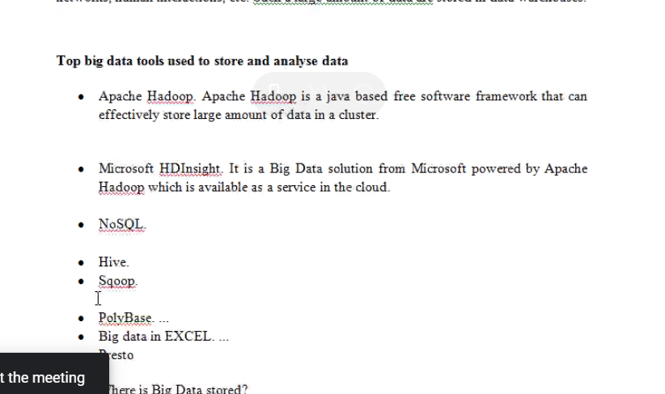
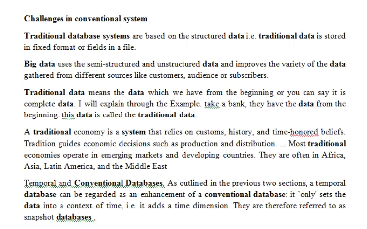
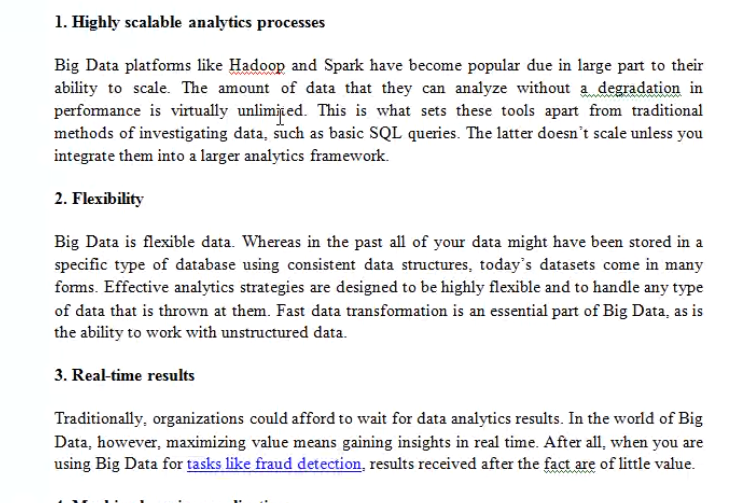
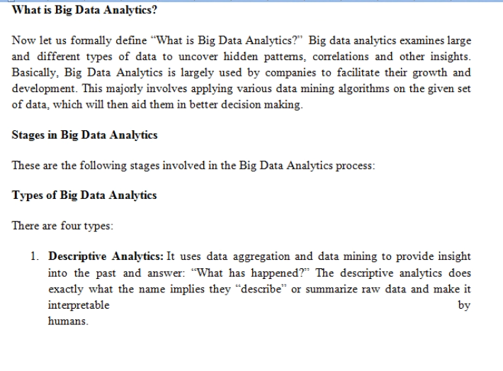

// read about these techs, to be asked in next class

    

//Big Data

    2021-03-23-12-07-30.png

    How is Big Data stored?
    Big Data is mainly focussed at unstructured data.
    using technologies such as Hadoop.

    sources of big data?
    three sources->
        social data
        machine data
        transactional data
    ex-> likes, tweets, retweets, comments, video uploads, and general media that are uploaded and shared via the wordls favorite social media platforms.

// challenges in conventional system (i.e., not Big Data systems)

    

// features of big data systems

     (contains 3 points)
    point 4. Machine Learning Applications

// Why Big Data Analytics

    Huge amounts of data is being generated every data which can be used by companies and organizations to generate actionable insights from the data and use it to make effective and efficient decisions. Therefore, it can be said that data is the new oil today and 
   

// What is Big Data Analytics

     //more points left