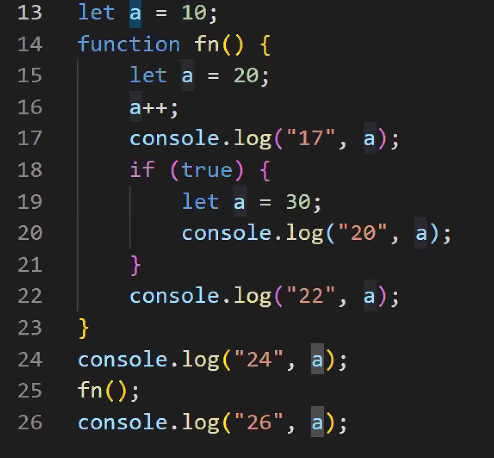
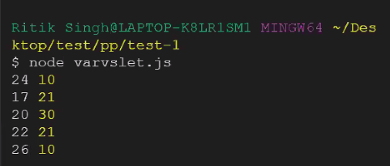
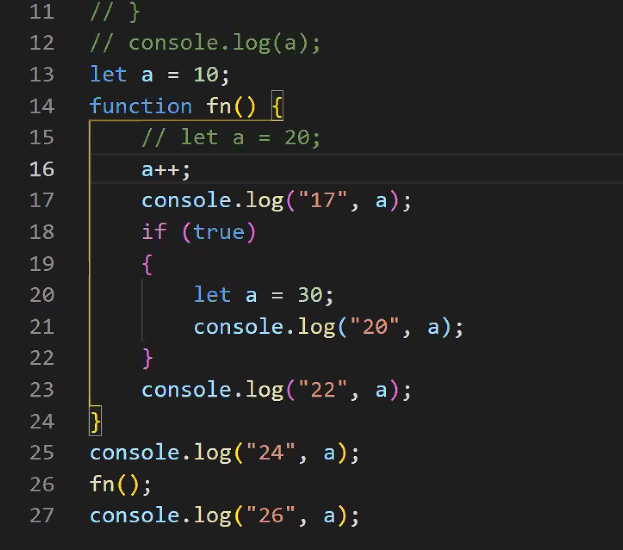
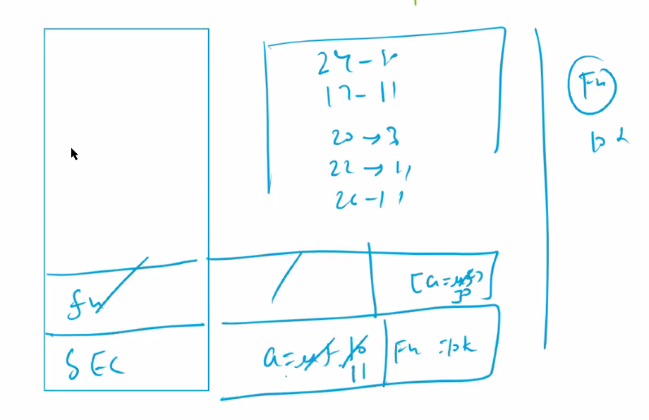
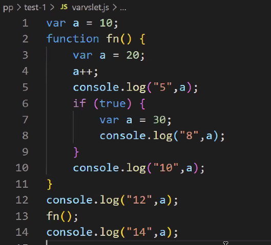
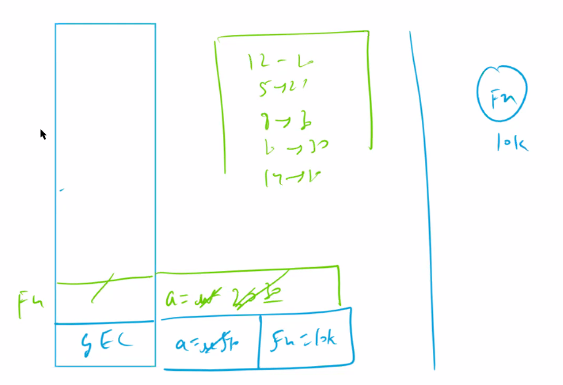
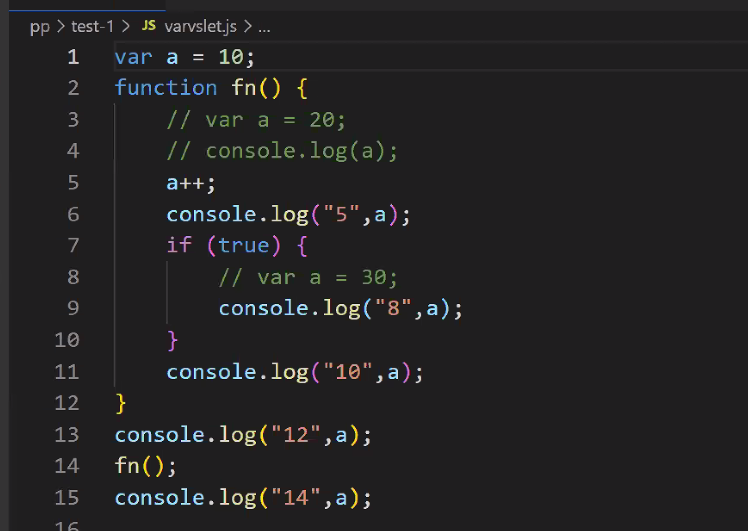
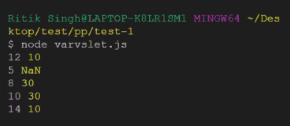

// let(example 1) let is block scoped,
no  redeclaration, we cant access it before its declaration.

    // code
    

    // output
    

// let(ex 2)

    // code
    

    // output

    // memory
    

// var > it is function scoped that means it is not available outside the fucntion
we can redeclare, you can access before its declared.

    //example 1
        //code
        

        //output

        //memory
        

    //example 2
        //code
        

        //output
        